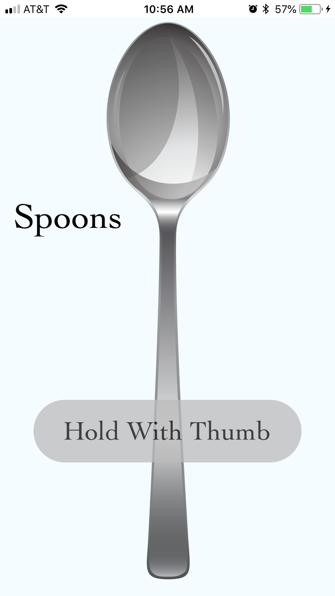

<br>

<p align="center">
  <a href="https://github.com/sam-parsons/MultiMeterMetronome">
    
  </a>
</p>

<h1 align="center">react-native-spoons</h1>

<p align="center">
  Play the spoons on iPhone or Android</a>.
  <br>
</p>

<p align="center">
    <a href="https://sam-parsons.github.io/MultiMeterMetronome">
    
    </a>
</p>

<br>
<br>

## Installation

```sh
git clone https://github.com/sam-parsons/react-native-spoons.git

cd react-native-spoons/

// In Xcode, open RNTEST.xcodeproj, build the project, and run on a phone

// This project requires using an actual phone as the development environment because the accelerometer will not work on an emulator
```

<!-- ## Features

## License

This project is licensed under the MIT License - see the LICENSE.md file for details. -->
